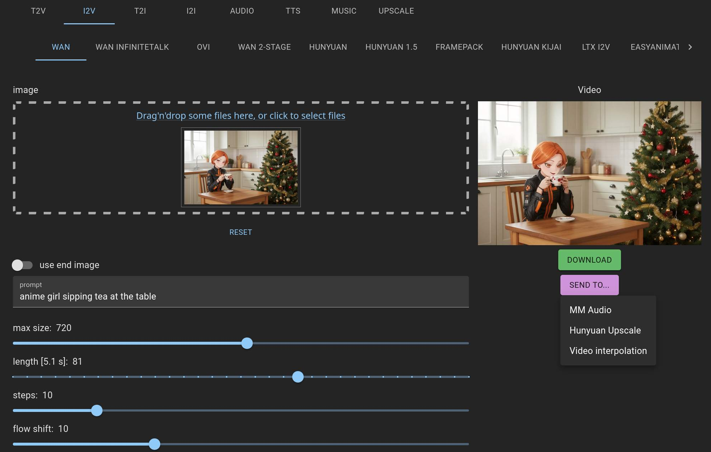
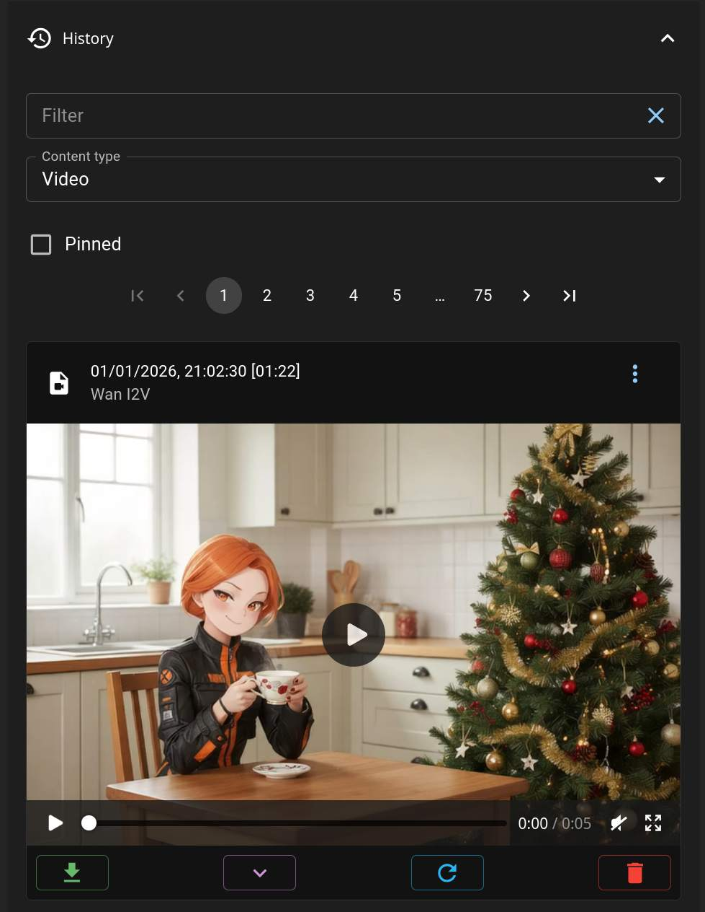
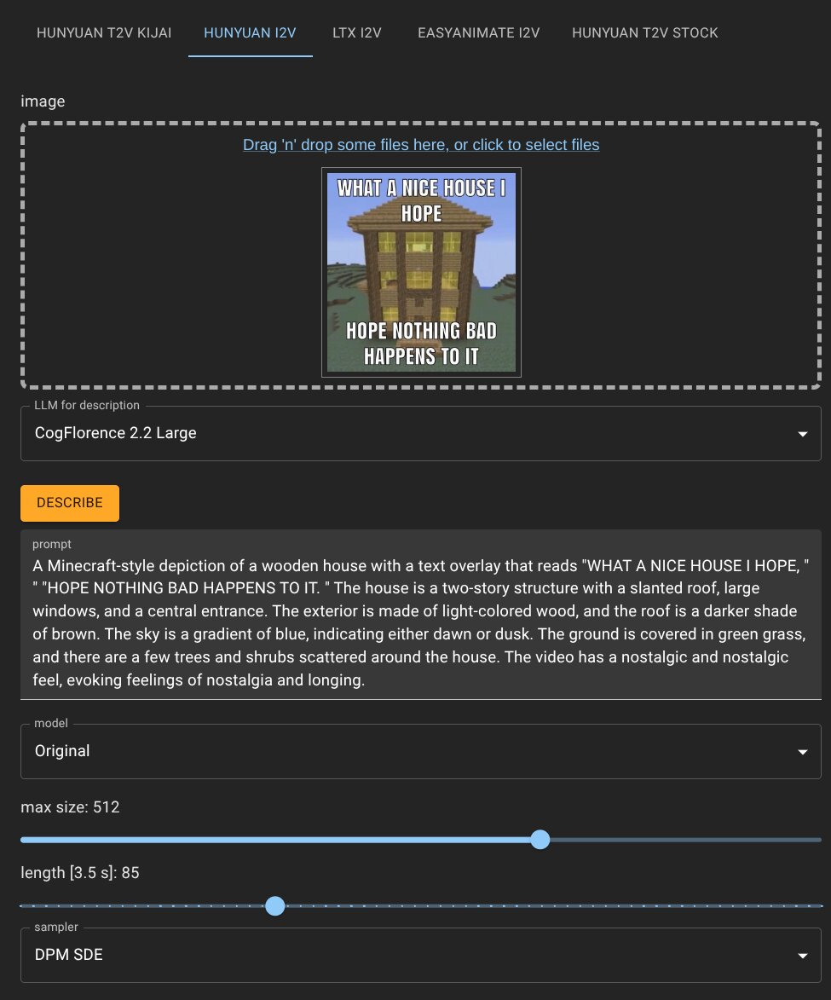

# CozyUI (fr this time)

This is a yet another frontend for ComfyUI to make it actually not so painful to use. It's designed after AUTOMATIC1111 Web UI and is mobile-friendly. Not "mobile first" really but I check it there often and improve UX.

## Screenshots

## Goals

-   make it simple to use
-   provide all the needed knobs and toggles
-   prevent eye bleeding while using it
-   allow adding more tabs/workflows _relatively easy_
-   keep it modular (component-wise)

## Non-goals

-   ComfyUI replacement
-   support any workflow imaginable
-   rewrite it in Rust

There was ComfyBox once. It is gone now (RIP). I don't want to set the bar too high only to abandon the project due to its overwhelming complexity. If you want to add a tab, you write it in React+MUI, there are some common controls already implemented, but if you need something custom you simply use whatever you want. Add dependencies if you like, keep every component in its own file and you'll be fine. There's no plugin/extension system, it's a UI for my own service so I extend it as needed.

## Stack

TypeScript/React/Redux/MaterialUI/react-hook-form/react-query/yarn and some small other libs. Pretty standard frontend stuff, nothing fancy or quirky.

## Building & running

Make sure you have Yarn 4 installed (not classic). Change `config.json`, find the `api` parameter at the very end and change it from `/cui` to the URL where your ComfyUI is located, for example: `"http://127.0.0.1:8188"`. You **have** to run ComfyUI with `--enable-cors-header "*"` to allow connections from other address/port. Run `yarn && yarn build`, then deploy the `dist` directory somewhere on a web server. Yes, you need an actual HTTP server, you can't just open `index.html` in browser because HTTP requests will not work this way. You should already have Python installed for ComfyUI, an easy way to serve the content is to `cd dist` and then do `python -m http.server` there. It will serve CozyUI at `http://127.0.0.1:8000`. If you want something more performant use Caddy and run `caddy file-server --listen 127.0.0.1:8000`.

## Developing

This project uses Yarn PnP. If you use VS Code you'll need to change the TypeScript SDK to the one Yarn creates for you. This is needed because there's no bloated `node_modules` and instead everything is virtualized but it doesn't play well with many editors such as VSC or vim. You need to be familiar with React and TypeScript already. Change `vite.config.ts` and set the `host` to your local IP (or `127.0.0.1`) and `proxy` parameters. Proxy is used to work around CORS during development if your ComfyUI is running on another IP or port. Most probably it'd be easier for you to use the CORS parameter as described in the previous section. I have a more complex setup with containers and front-end proxy, so for me it's better to resort to the Vite proxy to keep things as close to production as possible.

For example, if this webapp runs at `192.168.1.1:5173` and the `api` parameter from the above points at `/` (root), you want to proxy `/ws` (ComfyUI's websocket for receiving events) and `/api` (ComfyUI's API to send requests) to the actual ComfyUI address (for example, `192.168.1.1:8188`).

After this is set up, run `yarn dev` and it will tell you how to open the web app.

## Extending

To make a new tab you need to make a working workflow in ComfyUI first. Provide some sane defaults for the nodes if you don't plan to expose them all. Export the workflow as API (`Workflow ⇒ Export (API)`). Then make a new section in `config.json` with a new tab id (any string name) and fill it similarly to the existing ones.

There are a few keys, `api` should be set to your exported API file name, `controls` binds the UI controls to the nodes as `"control_name": { "id": "digital_node_id", "field": "node_field" }`. The `result` key defines where to get the execution results from, `{"id": "digital_node_id", "type": "data_type"}`. You can check out the data type in the browser console, see the `executed` message in the log and you'll find the output type there. For videos it's usually `gifs`, for text it's `text`.

`lora_params` sets some fields and node ids to insert multiple chained lora loaders somewhere in the workflow. It's not very comfortable to use currently so I'll describe it sometime later or remake it (you can guess how to define it from the existing workflows). The issue is that there are few lora loaders and few connection types, and it should be flexible enough to be used in different scenarios.

New tabs are added to `App.tsx` and defined in `controls/tabs` in individual files. Copy the existing file, rename, and change. Export `<WFTab label='Text in tab' value='tab id in config.json' content={<Content />} />` as it defines a new tab resource, edit the `<Content>` component. Don't forget to add a `<GenerateButton />` and `<VideoResult />`. You can also create buttons to run arbitrary workflows, see the `Describe Image` button.

If you forgot to bind some controls, or entered invalid node ids or field names you'll see the errors displayed by the generate button when you click it. You can temporarily disable actual ComfyUI API request to debug the form first by adding a `noexec` parameter to the generate button like this: `<GenerateButton noexec />`. The JSON to be submitted is also dumped to the browser console so you check if all settings applied well there.