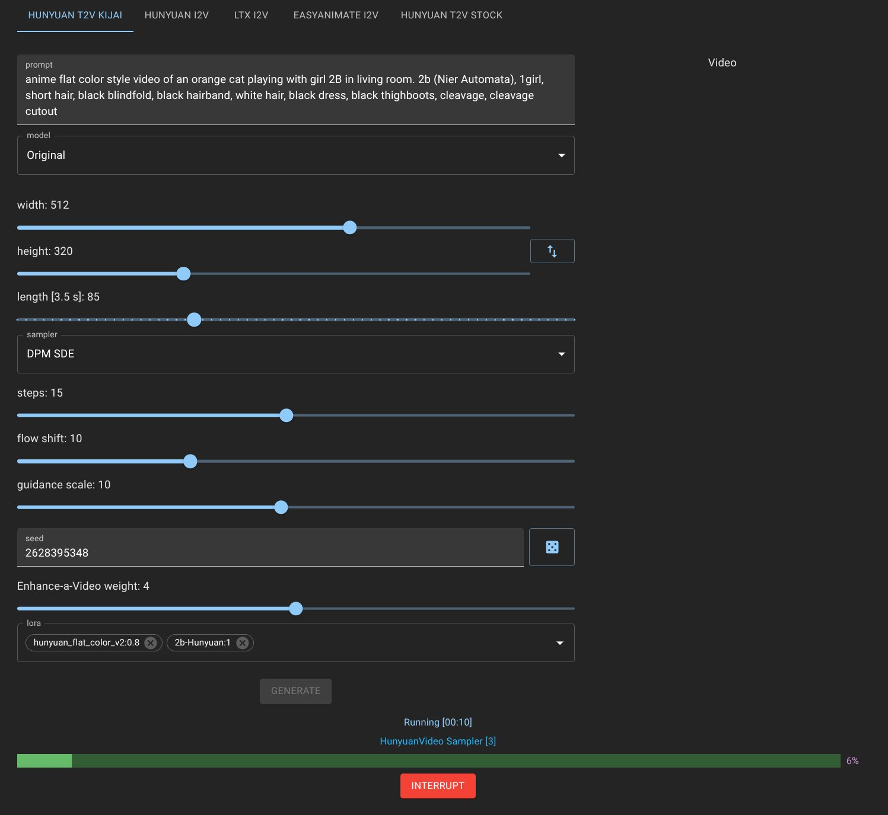

# CozyUI (fr this time)

This is a yet another frontend for ComfyUI to make it actually not so painful to use. It's designed after AUTOMATIC1111 Web UI and is mobile-friendly. Not "mobile first" really but I check it there often and improve UX.

## Screenshots

## Features

- Supported models and modes:
    - T2V
        - Hunyuan 1/1.5 (Native/Kijai)
        - Wan (Kijai)
    - I2V
        - Hunyuan 1.5
        - Hunyuan 1 (leapfusion lora)
        - Wan 2.1 (Kijai)
        - Wan 2.1 two-step
        - Wan 2.1 InfiniteTalk (Kijai)
        - Framepack
        - LTX I2V
        - EasyAnimate I2V
    - T2I
        - StableDiffusion 1.5/SDXL
        - Flux.1/2
        - Chroma
        - HiDream
        - Qwen Image
        - Z-Image
    - I2I
        - Flux Kontext
        - Qwen Image Edit
    - Upscale
        - Chroma upscale
        - SD Upscale
        - Hunyuan latent upscale
        - Video interpolation
    - T2A
        - StableAudio
        - MMAudio
    - TTS
        - Chatterbox (single/dialog)
        - VibeVoice (single/dialog, up to 4 speakers)
    - Music
        - ACE Step
        - SongBloom

- Lora support with weights and blocks to merge
- Animated/batch latent preview (if supported by ComfyUI)
- Config overrides to tune defaults for your system
- Docker support: ComfyUI+CozyUI
- AUTOMATIC1111-like UI, not Gradio but uses similar concepts
- Mobile-friendly
- Hotkeys:
    - Ctrl+Enter (run generation)
    - Ctrl+Up/Down (increase/decrease selection weight by 0.1)
    - Ctrl+Shift+Up/Down (increase/decrease selection weight by 1)
- History management:
    - Store/restore generation data and images/video/audio locally in your browser (IndexedDB), including timestamp and total generation time
    - Search (filter) by prompt/content type
    - Pin generations to prevent accidental deletion
    - Collection cleanup by time (before/after N seconds/minutes/hours/etc.), prompt, file type
    - Compare any two results side by side, generation data and videos, to see how changes affect the result
    - Import/Export to back up the history or transfer it to another browser/device
- Send results to other tabs if content type allows it (generate image => send to I2V for example)
- Customizable audio notification when task completes
- Localization support (English/Russian currently)
- Many controls have tips and explanation (can be disabled in settings)
- VRAM and speed optimizations: TeaCache, EasyCache, MultiGPU
- Hide any model tabs you don't need
- Danbooru tag completion
- Optionally save uploaded files in your browser and automatically reupload them if they were deleted in ComfyUI

## Goals

-   make it simple to use
-   provide all the needed knobs and toggles
-   prevent eye bleeding while using it
-   allow adding more tabs/workflows _relatively easy_
-   keep it modular (component-wise)

## Non-goals

-   ComfyUI replacement
-   support any workflow imaginable
-   rewrite it in Rust

There was ComfyBox once. It is gone now (RIP). I don't want to set the bar too high only to abandon the project due to its overwhelming complexity. If you want to add a tab, you write it in React+MUI, there are some common controls already implemented, but if you need something custom you simply use whatever you want. Add dependencies if you like, keep every component in its own file and you'll be fine. There's no plugin/extension system, it's a UI for my own service so I extend it as needed.

## Stack

TypeScript/React/Redux/MaterialUI/react-hook-form/react-query/yarn and some other libs. Pretty standard frontend stuff, nothing fancy or quirky.

## Building & running

Make sure you have Yarn 4 installed (not classic). Change `conf/config.json`, find the `api` parameter at the very end and change it from `/cui` to the URL where your ComfyUI is located, for example: `"http://127.0.0.1:8188"`. You **have** to run ComfyUI with `--enable-cors-header "*"` to allow connections from a different address/port. Run `yarn && yarn build`, then deploy the `dist` directory somewhere on a web server. Yes, you need an actual HTTP server, you can't just open `index.html` in browser because HTTP requests will not work this way. You should already have Python installed for ComfyUI, an easy way to serve the content is to `cd dist` and then do `python -m http.server` there. It will serve CozyUI at `http://127.0.0.1:8000`. If you want something more performant use Caddy and run `caddy file-server --listen 127.0.0.1:8000`.

## Docker

A basic Docker setup (NVIDIA-only, I don't have AMD) is provided to get you started in no time, from scratch. It's best to have Docker Compose as well to install both ComfyUI and CozyUI. First, download the models (Hunyuan only, the rest you can add later yourself) with `docker/download_models.sh`. It will take some time. The model directory structure will be created as well.

After you have the models downloaded, run `docker compose up -d` and wait. You'll have two containers up and running. Open `http://127.0.0.1:3000` and try generating something in Hunyuan. If it doesn't work, check out the container logs with `docker compose logs comfyui` and see what the problem is. If some model is absent you'll see the expected path and can put it there in the `models/` directory in the program root. Note, that `docker/config.local.json` is mounted in CozyUI container by default. You can change it in `compose.yml` or modify the config itself. ComfyUI should be available at `http://127.0.0.1:8188`.

The custom node list is in `docker/custom_nodes.txt`, it's probably outdated but it's a good starting point.

## Model location

Models are expected to be placed in certain directories relative to ComfyUI root. Since new models and workflows are being added all the time it's best to simply run a workflow and check ComfyUI logs for errors about missing files, then put them where they are expected. Apologies for that! Maintaining this list doesn't make much sense unless CozyUI is installed by more than two people.

### Hunyuan

- Path: `models/diffusion_models/hyvid/`

- Filenames:
    - regular FP8-quantized model: `hunyuan_video_720_fp8_e4m3fn.safetensors`
    - FastVideo: `hunyuan_video_FastVideo_720_fp8_e4m3fn.safetensors`
    - VAE: `models/vae/hyvid/hunyuan_video_vae_bf16.safetensors`
    - GGUF-quantized models: `models/unet` (add them to `config.local.json` to use)

GGUF models can be dynamically offloaded to RAM allowing generating higher resolution, longer videos. See `Virtual VRAM` slider in advanced parameters.

#### Hunyuan loras

- Path: `models/loras/`

They're additionally filtered by path component `hyvid/` which can be overridden in `conf/config.local.json` as `loras.hunyuan.filter` (see `conf/config.json`). It's a simple string filter, only files that have this string in the full path will be shown.

### Wan

- Path: `models/diffusion_models/wan/`
- Filenames:
    - T2V: `Wan2_1-T2V-14B_fp8_e4m3fn.safetensors`, `Wan2_1-T2V-1_3B_fp8_e4m3fn.safetensors`
    - I2V: `Wan2_1-I2V-14B-480P_fp8_e4m3fn.safetensors`, `Wan2_1-I2V-14B-720P_fp8_e4m3fn.safetensors`
    - VAE: `models/vae/wan_2.1_vae.safetensors`

### LTX Video

- Filename: `models/checkpoints/video/ltx-video-2b-v0.9.1.safetensors`

### EasyAnimate

- Path: `models/EasyAnimate/EasyAnimateV5.1-12b-zh-InP`

Should download automatically if absent

### Stable Audio

- Filename: `models/checkpoints/audio/stable_audio.safetensors`

### MMAudio

- Path: `models/mmaudio`

Some files can be downloaded with `docker/download_models.sh`, some are automatically downloaded on first generation.

### LLM

For Hunyuan and descriptions, they will download automatically on first use. Path: `models/LLM`

## Developing

This project uses Yarn PnP. If you use VS Code you'll need to change the TypeScript SDK to the one Yarn creates for you. This is needed because there's no bloated `node_modules` and instead everything is virtualized but it doesn't play well with many editors such as VSC or vim. You need to be familiar with React and TypeScript already. Change `vite.config.ts` and set the `host` to your local IP (or `127.0.0.1`) and `proxy` parameters. Proxy is used to work around CORS during development if your ComfyUI is running on another IP or port. Most probably it'd be easier for you to use the CORS parameter as described in the previous section. I have a more complex setup with containers and front-end proxy, so for me it's better to resort to the Vite proxy to keep things as close to production as possible.

For example, if this webapp runs at `192.168.1.1:5173` and the `api` parameter from the above points at `/` (root), you want to proxy `/ws` (ComfyUI's websocket for receiving events) and `/api` (ComfyUI's API to send requests) to the actual ComfyUI address (for example, `192.168.1.1:8188`).

After this is set up, run `yarn dev` and it will tell you how to open the web app.

## Extending

The architecture allows making arbitrary UI controls and bind them to arbitrary nodes and fields in the workflow. It works like this:
- every control has a `name` which should be unique within the tab
- the control value is stored in the form context (created automatically for each tab)
- when you click `Generate` every value stored in the form is processed using `config.json`:
    - either it's simply assigned to the `id`/`field` specified there
    - or it's handled in a special way if the `id` field is set to `handle` (look for `useRegisterHandler` hook in controls for examples)
    - or it's skipped if the `id` field is set to `skip` (useful if the value needs to be stored for some handler but not processed on its own)

In the end this scheme allows to decouple controls from workflows using `config.json` definitions. `Control` ⇒ `config.json` => `workflow node and field`. With custom handlers it's possible to dynamically add or remove nodes, connections, and even reconfigure the entire workflow before submitting it to ComfyUI. It's represented as a plain JS object so you can do anything with it. There are also a few simple helper functions to insert and replace nodes. You can use the regular hooks from `react-hook-form` to access and change the form values from within the tab or controls, such as `useFormContext` or `useWatch`, it's the only source of truth when it comes to generation.

To make a new tab you need to make a working workflow in ComfyUI first. Provide some sane defaults for the nodes if you don't plan to expose them all. Export the workflow as API (`Workflow ⇒ Export (API)`). Then make a new section in `config.json` with a new tab id (any string name) and fill it similarly to the existing ones.

There are a few keys, `api` should be set to your exported API file name, `controls` binds the UI controls to the nodes as `"control_name": { "id": "digital_node_id", "field": "node_field" }`. The `result` key defines where to get the execution results from, `{"id": "digital_node_id", "type": "data_type"}`. You can check out the data type in the browser console, see the `executed` message in the log and you'll find the output type there. For images it's `images`, for videos it's usually `gifs`, for text it's `text`.

`lora_params` sets some fields and node ids to insert multiple chained lora loaders somewhere in the workflow. It's not very comfortable to use currently so I'll describe it sometime later or remake it (you can guess how to define it from the existing workflows). The issue is that there are few lora loaders and few connection types, and it should be flexible enough to be used in different scenarios.

New tabs are added to `App.tsx` and defined in `controls/tabs` in individual files. Copy the existing file, rename, and change. Export `<WFTab label='Text in tab' value='tab id in config.json' content={<Content />} />` as it defines a new tab resource, edit the `<Content>` component. Don't forget to add a `<GenerateButton />` and `<VideoResult />` (or `<AudioResult />` etc. depending on your output type). You can also create buttons to run arbitrary workflows, see the `Describe Image` button.

If you forgot to bind some controls, or entered invalid node ids or field names you'll see the errors displayed by the generate button when you click it. You can temporarily disable actual ComfyUI API request to debug the form first by adding a `noexec` parameter to the generate button like this: `<GenerateButton noexec />`. The JSON to be submitted is also dumped to the browser console so you can check if all settings applied correctly there.

There are a few checks to ensure your workflow is bound properly:
- all form values should be bound, i.e. have a corresponding entry in `config.json`
- all defined `config.json` controls should get assigned a value from the form, i.e. the corresponding control should exist and should set a non-undefined value; make sure it's assigned by default if user hasn't changed anything and just pressed `Generate`
- all defined `config.json` controls with `id`/`field` pairs (except `handle` and `skip` ids) should match the existing nodes in the workflow

If any of these rules are violated you'll see errors when you generate. Make sure you have none in all cases, if some control values are optional you should use a handler (to dynamically add a node/connection) or a `defaultValue`.

## Config overrides

You can create a file named `config.local.json` in `public/conf` directory in the source or in the root of the deployed app (next to `conf/config.json`). This file is loaded and merged on top of `config.json` so you can provide local defaults, overrides, and additional parameters. The arrays are concatenated, you can append models like this. There are some `defaults` sections in `config.json` which defines the default models but it also works with all controls you see in the UI. The keys in that section are control names and the values are, well, their desired values. Controls don't *have* to have a UI representation as long as they're bound to the workflow (API) in the config, see the `controls` section. However, if you add more controls make sure to provide the default values too, otherwise an error during generation would be shown: `Missing controls (present in API)` with a list of controls that don't have values. If you provided the defaults but forgot to make bindings for them in the config, the error would be `Missing API bindings (present controls)`. Invalid control definitions that have a non-existent node id are reported as `Missing API ids`, those without a field are reported as `Missing API fields`. Normally you shouldn't see any such errors if you only use the stock config and no overrides.

## Lora previews

Add `preview_root` value to `config.local.json` with a URL root for the lora previews. If lora file is `sdxl/characters/loraName.safetensors`, then image previews should be named as `sdxl/characters/loraName.preview.png` and video previews should be `sdxl/characters/loraName.preview.mp4` (regardless of the actual file type). The URL root from `preview_root` is prepended to this lora file and used as image/video source. For example, if you host the previews at `http://localhost:3000/lora_previews` and set `preview_root` to this value, then the previews are expected to be found at `http://localhost:3000/lora_previews/sdxl/characters/loraName.preview.png` and `.mp4`.

You can download previews for your existing loras from CivitAI (if they exist there, of course) using [Authproxy](https://github.com/SD-inst/authproxy). Compile the downloader binary with `go build ./cmd/civitaimetadl`, then run `./civitaimetadl /path/to/loras`. The entire directory and all subdirectories will be processed and the files will be placed next to the lora files. Only `.safetensors` files without accompanying .preview/.json files will be processed to save time on subsequent runs.
